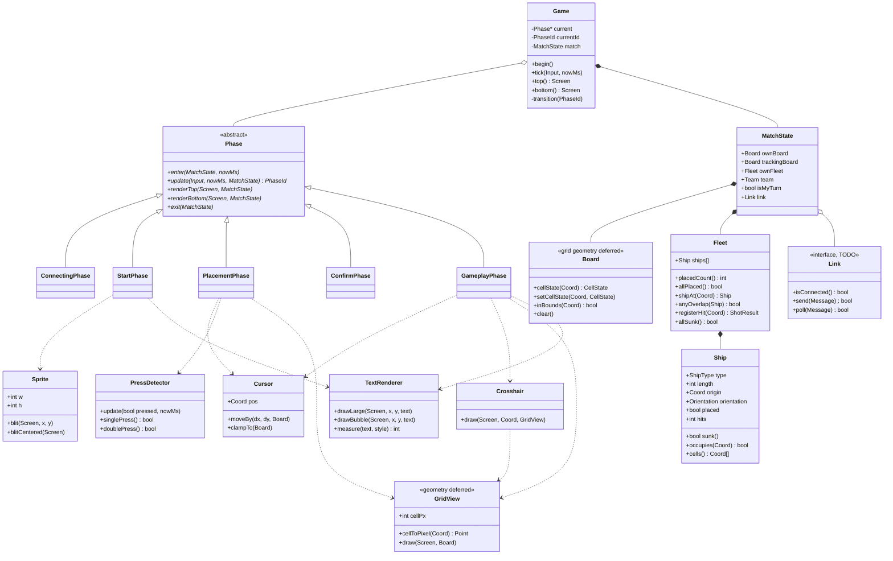
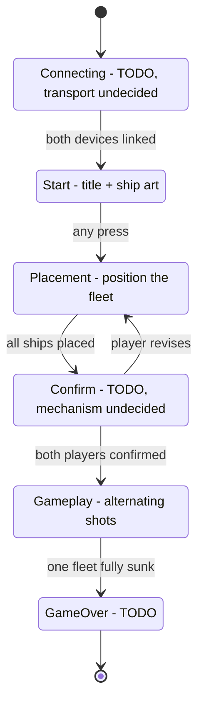

# Design plan

Status: **design only.** No implementation exists for anything below. Nothing
in this document has been written as C or C++ yet, and the grid is explicitly
left undefined (see [Deferred](#deferred-decisions)).

Rules source: `Battleship_rules.pdf` (Milton Bradley, 1990). Section 0 below
records what that document settles; anything it does not settle is still open.

Everything here must obey the existing constraints in `CLAUDE.md`: it lives in
`src/game/`, stays free of Arduino/hardware headers, takes time from a `nowMs`
argument, and treats the two panels as two independent 128x64 surfaces.

---

## 0. Rules from `Battleship_rules.pdf`

The official rulebook settles several things this plan previously listed as
open questions.

| Rule | Text of record |
| --- | --- |
| Object | Be the first to sink all 5 of your opponent's ships. |
| Fleet | 5 ships per player: Carrier 5, Battleship 4, Cruiser 3, Submarine 3, Destroyer 2 (17 cells total). |
| Placement | Horizontal or vertical only, never diagonal. No part may overlap another ship or leave the grid. Ships cannot be moved once the game has begun. |
| Turn order | Players **alternate strictly**: "After a hit or a miss, your turn is over." One shot per turn. |
| Shot report | The defender answers hit or miss, and on a hit also names *which ship* was hit ("Hit. Cruiser."). |
| Sinking | When every cell of a ship is hit, it is sunk and the owner must announce which ship was sunk. Sunk opponent ships are tallied (5 slots). |
| Miss record | The attacker records misses on the tracking grid so the same shot is not called twice. The defender need not record opponent misses. |
| Win | First player to sink the opponent's entire 5-ship fleet wins. |

Not stated by the rulebook, so still ours to decide:

- **Grid size.** The rulebook's figures are cropped examples (Figure 4 shows
  A-G x 1-8, Figures 5-6 show A-D x 1-5); no dimension is given in the text.
  The physical board is 10x10 (A-J, 1-10), which is the assumption to
  confirm. See [Deferred](#deferred-decisions).
- Who moves first ("Decide who will go first" - no procedure given).
- Everything electronic: linking, confirming, timing, display.

**SALVO variant** (rulebook, page 3): 5 shots per turn, marked white then
upgraded to red on hits, and one shot lost per ship of yours that has been
sunk. Out of scope for v1; noted so the turn model is not designed in a way
that forecloses it.

---

## 1. Object model



### 1.1 Responsibilities

| Class | Owns | Notes |
| --- | --- | --- |
| `Game` | the active `Phase`, the `MatchState`, transitions | Already exists as a shell. Becomes a pure dispatcher: no game rules of its own. |
| `Phase` | one screen's worth of behaviour | Abstract. `update()` returns the `PhaseId` to run next (itself = stay). Render is split top/bottom because the panels are separate devices. |
| `MatchState` | all data that outlives a phase | Passed to every phase rather than held by them, so phases stay swappable and testable. |
| `Board` | cell occupancy and shot marks | **Geometry deliberately unspecified.** Only the interface is fixed. |
| `Fleet` | the set of `Ship`s and rules over them | Owns overlap checks and sink detection so no phase duplicates that logic. |
| `Ship` | one vessel: type, length, origin, orientation, damage | `cells()` is the single source of truth for which coords it covers. |
| `Link` | the 2-device transport | **TODO** — interface only, no transport chosen. |
| `Cursor` | a selection position on a board | Shared by placement and targeting; movement clamped by the `Board`. |
| `PressDetector` | single vs double press on CENTER | Isolated because the timing rules are fiddly (see 4.3). |
| `Sprite` | a packed 1bpp bitmap | Used for the title-screen ship. |
| `TextRenderer` | large and bubble-style text | The existing 5x7 font is too small for the title and the HIT/MISS overlay. |
| `GridView` | mapping cells to pixels, drawing a board | **Geometry deferred.** Holds `cellPx` (5 for the gameplay grid). |
| `Crosshair` | the targeting reticle | Separated from `GridView` so the grid can be drawn without it. |

### 1.2 Supporting types

| Type | Kind | Members |
| --- | --- | --- |
| `PhaseId` | enum | `Connecting`, `Start`, `Placement`, `Confirm`, `Gameplay`, `GameOver` |
| `Team` | enum | `Red`, `Blue` |
| `Orientation` | enum | `Horizontal`, `Vertical` |
| `CellState` | enum | `Empty`, `Ship`, `Hit`, `Miss` |
| `ShotResult` | enum | `Miss`, `Hit`, `Sunk`, `Invalid`. `Hit` and `Sunk` both carry the `ShipType` struck, since the rules require naming the ship. |
| `ShipType` | enum | `Carrier` (5), `Battleship` (4), `Cruiser` (3), `Submarine` (3), `Destroyer` (2) - fixed by the rulebook, section 0 |
| `Coord` | struct | grid `col`, `row` |
| `Point` | struct | pixel `x`, `y` |
| `Message` | struct | link payload — **TODO**, shape depends on transport |

---

## 2. Phase machine



---

## 3. Phase specifications

### 3.1 Connecting &mdash; TODO

Pairs the two devices. **Nothing here is decided**: not the transport
(ESP-NOW, Wi-Fi, BLE, wired UART), not the pairing handshake, not who becomes
`Team::Red`, not the failure/retry behaviour. The `Link` interface is a
placeholder so the rest of the design has something to hold; it will change
once a transport is picked.

Blocking question: does this phase run before the start screen, or in the
background while the title shows? Listed in [Open questions](#open-questions).

### 3.2 Start page

| Panel | Content |
| --- | --- |
| Top | "BATTLE SHIP" in large text, with "TEAM RED" beneath it |
| Bottom | The ship sprite, centered |

- The team label reflects `MatchState::team`, so "TEAM RED" is one of at least
  two strings, not a constant.
- Large text needs `TextRenderer::drawLarge`; the current 5x7 font is a
  fallback only, so a larger glyph set is a prerequisite.
- The sprite is **48x48**, centered. At 1bpp that is 2304 px = 288 bytes =
  **576 hex characters** (the "144 hex characters" in the original spec was
  the figure for 24x24 and is superseded). Centered on 128x64 puts its
  top-left at x=40, y=8.
- Advances on any button press. Whether it also waits for `Link` is open.

### 3.3 Ship placement

| Panel | Content |
| --- | --- |
| Top | The list of ships still to place, with the active one indicated |
| Bottom | The board, with the active ship drawn at the cursor as a ghost |

Controls:

| Input | Action |
| --- | --- |
| Arrows | Move the active ship's origin by one cell |
| CENTER, single | Rotate the active ship 90 degrees |
| CENTER, double | Place the active ship and advance to the next |

Rules:

- The fleet is the rulebook's five ships, placed in that order: Carrier (5),
  Battleship (4), Cruiser (3), Submarine (3), Destroyer (2).
- A placement is legal only if every cell the ship covers is in bounds and no
  cell overlaps an already-placed ship. `Fleet::anyOverlap()` is the authority.
- Orientation is horizontal or vertical only; diagonals are not representable
  by `Orientation`, which matches the rule.
- Illegal positions are rendered differently (dashed/blinking ghost) rather
  than being unreachable, so the player can see why it will not fit.
- A double press on an illegal position is rejected: the ship is not placed
  and the phase gives feedback rather than silently ignoring it.
- Rotation that would push the ship out of bounds is handled by 4.2.
- When the last ship is placed, transition to Confirm. After Confirm, ships
  are immutable for the rest of the match ("Do not change the position of any
  ship once the game has begun").

### 3.4 Confirm &mdash; TODO

Both players lock in their layouts before shooting starts. **The mechanism is
undecided**: what the confirm gesture is, whether a player can go back and
re-place, what each panel shows while waiting for the opponent, and what
happens on a timeout. The transition edges are drawn above so the machine is
complete, but the interaction is unspecified.

### 3.5 Gameplay

| Panel | Content |
| --- | --- |
| Top | Tracking grid of shots taken against the opponent: `X` = hit, `O` = miss, at 5x5 px per box |
| Bottom | The player's own ship layout, plus damage |

Targeting:

- Arrows move the `Cursor` one cell at a time over the tracking grid.
- The selected cell is marked with a crosshair: **two vertical lines**
  spanning the full panel height and **two horizontal lines** spanning the
  full panel width, arranged so the selected cell sits centered between them.
  See the TODO in 3.5.1 &mdash; this one is yours.
- CENTER fires at the selected cell. Re-firing an already-resolved cell is
  rejected (see 4.4).

Result feedback, on **both** devices after a shot resolves:

- The bottom panel shows a large bubble-text overlay reading `HIT` or `MISS`,
  drawn over the ship layout rather than replacing it.
- The overlay stays up for `OVERLAY_MS`, default **3000 ms**, measured
  against `nowMs`. It is a tunable in `game_config.h` (section 6), not a
  literal.
- On a hit the rules require naming the ship struck, and on a sink require
  announcing it. So the overlay has three forms, not two: `MISS`, `HIT` (with
  the ship name beneath, e.g. `HIT / CRUISER`), and `SUNK` + ship name. The
  defender sees the same report for the shot taken against them.
- A ship that becomes fully destroyed has a single line struck through it
  along its axis, drawn persistently from then on.

#### 3.5.1 TODO &mdash; crosshair (owner: you)

`Crosshair::draw()` is **reserved**. The shape is settled (two vertical, two
horizontal, selected cell centered between them) but the exact geometry
&mdash; line placement relative to the cell edges, thickness, whether lines
are solid or dashed, and how they interact with the `X`/`O` marks they cross
&mdash; is yours to define and implement. Nothing else in this plan should
assume more than the interface.

Note the asymmetry worth confirming: the attacker's bottom panel shows their
*own* ships, so an overlay there reports the result of the shot they just
fired, not damage to the ships displayed underneath it.

---

## 4. Edge cases

### 4.1 Bounds
- A ship may never extend past any board edge, in either orientation.
- Cursor movement clamps at the edges rather than wrapping.
- The clamp must account for ship length and orientation: a horizontal ship of
  length *n* cannot have its origin closer than *n* cells to the right edge.

### 4.2 Rotation near an edge
Rotating in place can push a ship out of bounds. Three candidate behaviours:
1. **Reject** the rotation, leaving the ship as it was.
2. **Kick** the ship inward by the minimum offset that makes it legal.
3. **Allow** the rotation and render it as illegal until moved.

Recommendation: kick, falling back to reject when no offset works. Undecided.

### 4.3 Single vs double press on CENTER
Rotate and place share one button, so a single press cannot be classified
until the double-press window expires. Two options:
1. **Defer** rotation until the window closes. Correct, but adds visible input
   latency to every rotation.
2. **Rotate immediately**, and on a second press within the window, undo that
   one rotation and place. Instant feedback, slightly more state.

Recommendation: option 2. The window length is undecided.

Related: a triple press, and a press held down rather than tapped, both need
defined behaviour. Currently undefined.

### 4.4 Shooting
- Firing at a cell already marked `Hit` or `Miss` is rejected, with feedback.
- Firing out of turn is rejected. Turn ownership lives in
  `MatchState::isMyTurn`.
- A shot in flight (sent, not yet acknowledged) must not allow a second shot.
  Requires `Link`, so it is blocked on the transport decision.
- **Turns alternate strictly.** The rulebook is explicit: "After a hit or a
  miss, your turn is over." One shot per turn, and `Hit` and `Sunk` pass the
  turn exactly as `Miss` does. (An earlier draft of this plan had a hit grant
  another shot; that is not the official rule and is dropped.)

### 4.5 Fleet integrity
- No two ships may share a cell; `Fleet::anyOverlap()` is checked on every
  placement attempt.
- Placement cannot complete while any ship is unplaced.
- `Fleet::allSunk()` ends the match, which is the only `GameOver` trigger: the
  first player to sink all five opposing ships wins.
- A sink must be reported, not just detected: the shot result names the ship,
  and the winner-side UI keeps a tally of the five opposing ships sunk
  (the rulebook's five pegs at the top of the unit).

### 4.6 Link failure
Disconnection mid-match, dropped messages, and desynchronised turn state are
all **undefined** pending the transport decision.

---

## 5. Open questions

These need your input; I have not assumed answers.

### 5.1 Ship sprite size &mdash; the stated numbers conflict

A 1bpp bitmap packs 4 pixels per hex character:

| Size | Pixels | Bytes | Hex characters |
| --- | --- | --- | --- |
| 24x24 | 576 | 72 | **144** |
| 48x48 | 2304 | 288 | **576** |

The spec says 48x48 *and* 144 hex characters, which cannot both hold. Either
the sprite is 24x24 at 144 hex characters, or it is 48x48 at 576. Both fit
centered on a 128x64 panel. Which did you mean?

Also relevant: `ship.png` is 512x512, 8-bit palette, so it needs
downscaling and thresholding to mono. The `png2bitmap` converter and
`ship_bitmap.hex` that were in this repo earlier are **no longer on disk**, so
that tooling has to be rebuilt regardless.

### 5.2 Crosshair shape
"A vertical line on both sides" is unambiguous (two lines bracketing the
cell). "A horizontal line" is singular &mdash; one line through the cell, or a
bracketing pair matching the verticals?

### 5.3 Overlay duration
How long does the `HIT`/`MISS` bubble stay up, and does it block input while
shown or merely draw over the layout?

### 5.4 Fleet composition &mdash; RESOLVED
Five ships: Carrier 5, Battleship 4, Cruiser 3, Submarine 3, Destroyer 2, per
section 0. `ShipType` is no longer a placeholder.

### 5.5 Who fires first
Settled by the rulebook only as "Decide who will go first" - no procedure. The
device has to pick one deterministically, which is bound up with team
assignment in Connecting, so it is deferred with that.

---

## Deferred decisions

Explicitly **not** designed here, at your instruction or because a
prerequisite is missing:

- **Grid geometry.** Board dimensions, cell count, and the pixel origin of
  each board. The rulebook never states a size; the physical game is 10x10
  (rows A-J, columns 0-9 as rendered) and that is the working assumption. At
  5x5 px, ten cells sharing borders close on 51x51 px, which fits a 128x64
  panel with room for labels either side. `Board` and `GridView` exist as interfaces with no geometry.
  The only fixed number is the 5x5 px cell for the gameplay tracking grid.
- **Connecting.** Transport, pairing, team assignment, failure handling.
- **Confirm.** The entire interaction.
- **Game over.** What the end screen shows and what follows it.
- **Persistence.** Whether anything survives a reset.


---

## 7. What the lobby changed (implemented)

`§2`'s phase machine assumed two players who already knew about each other.
Building a lobby broke that assumption in one specific place: **identity**.

| | As designed in §1 | As built |
| --- | --- | --- |
| a player is | one of two, implied | a UUID the client keeps |
| the name is | not modelled | a label; duplicates are fine |
| a seat is | the identity | a role, given out when a match starts |
| how many connect | two | many; two per match |

The phase machine gains one state, between `Start` and `Placement`:

```
Start -> Connecting -> Lobby -> Placement -> Waiting -> Gameplay -> GameOver
```

- **Lobby** lists everyone else connected. The relay removes the caller from
  that list, so selecting yourself is not something a client can get wrong.
- **Pairing is mutual.** An invitation is half of an agreement, not an offer
  awaiting acceptance -- so there is no accept/decline state to get out of
  step. The relay starts a match when it sees both halves.
- **Seats are decided by UUID order**, not by who chose second. Seat A shoots
  first, so click order would hand out the first move at random -- and a
  reconnecting player has to land in the seat they left, which only holds if
  the assignment can be derived from the two identities alone.

`§3.4 Confirm` is answered by this: the waiting page is the confirm step, and
what it waits for is the other fleet arriving rather than a gesture.

**Reconnect** is possible because the log is the match: replaying a player's
view rebuilds their boards through the same packet handlers that built them
the first time, so there is no second description of a game to disagree with
the first. `§4.6 Link failure` is therefore no longer undefined for the case
where a player simply comes back.

**Still open:** ESP-NOW (`Mode::Offline` exists and leads to solo play until
the radio does), and the SALVO variant of `§0`.
