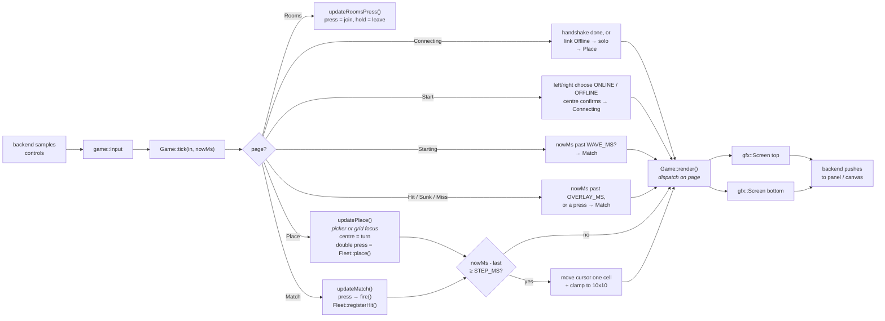
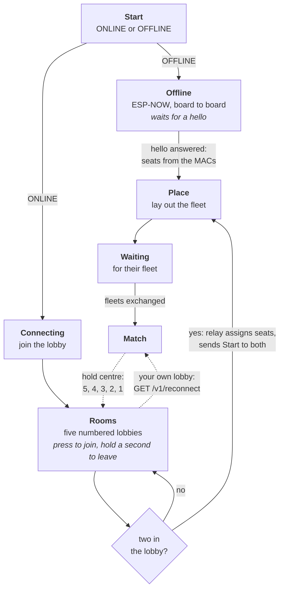

# battleship-esp

Two 128x64 SSD1306 panels driven by an ESP32-C3, with a 5-way switch.

The application code is hardware-independent and compiles unchanged for two
targets: the real board, and a WebAssembly build that runs in a browser. Work
done in the simulator runs as-is on the device.

## Architecture

`src/game/` is the portable core. Both backends do nothing but fill in a
`game::Input` and push the two resulting `gfx::Screen` buffers somewhere.

```mermaid
flowchart TB
    subgraph CORE["src/game/ &mdash; portable core (no hardware, no Arduino)"]
        direction TB
        INPUT["<b>input.h</b><br/>struct Input<br/><i>up down left right center</i>"]
        GAME["<b>game.h / game.cpp</b><br/>Game::begin()<br/>Game::tick(Input, nowMs)<br/><i>page dispatch + start/result</i><br/><i>Start Place Starting Match Hit Miss Sunk</i>"]
        PLACEP["<b>place_page.cpp</b><br/>updatePlace() renderPlace()<br/><i>ship picker + board</i>"]
        MATCHP["<b>match_page.cpp</b><br/>updateMatch() renderMatch()<br/>Game::fire()<br/><i>aim, damage, roster</i>"]
        FLEET["<b>fleet.h / fleet.cpp</b><br/>Ship Fleet ShotResult<br/><i>legality, overlap, sinking</i><br/><i>the only rules authority</i>"]
        PRESS["<b>press.h</b><br/>PressDetector &mdash; centre turns,<br/>double press places<br/><i>the undoable gesture waits</i>"]
        CFGG["<b>game_config.h</b><br/>STEP_MS DOUBLE_MS<br/>OVERLAY_MS WAVE_MS"]
        NET["<b>netplay.h</b><br/>NetPacket: v seq src dst t a b<br/><i>the protocol as the core sees it</i><br/><i>no transport; static_asserts</i><br/><i>pin the enums to PROTOCOL.md</i>"]
        SCREEN["<b>screen.h / screen.cpp</b><br/>gfx::Screen 128x64<br/>primitives, 5x7 + 3x5 fonts<br/><i>scaled + bubble text</i>"]
        GRID["<b>grid.h / grid.cpp</b><br/>10x10 grid, 51x51 px<br/><i>ruled + dot styles</i><br/><i>labels, marks, crosshair</i>"]
        SPRITE["<b>sprite.h / sprite.cpp</b><br/>1bpp blit<br/><i>ship_sprite.inc 48x48</i>"]
        INPUT --> GAME
        INPUT --> PRESS
        PRESS --> GAME
        CFGG --> GAME
        GAME --> NET
        NET --> FLEET
        GAME --> PLACEP
        GAME --> MATCHP
        PLACEP --> FLEET
        MATCHP --> FLEET
        FLEET --> GRID
        PLACEP --> GRID
        MATCHP --> GRID
        GAME --> GRID
        GAME --> SPRITE
        GRID --> SCREEN
        SPRITE --> SCREEN
        GAME --> SCREEN
    end

    subgraph DEVICE["DEVICE target &mdash; ESP32-C3 (pio run)"]
        direction TB
        SW["5-way switch<br/>GPIO 1/2/3/10/20"]
        SER["serial monitor<br/><i>arrows / WASD / Space</i>"]
        CTRL["<b>include/controls.h</b><br/>controlsPoll()<br/>GPIO OR keystrokes<br/><i>rotates the switch</i>"]
        DMAIN["<b>src/main.cpp</b><br/>device backend"]
        DISP["<b>include/display.h</b><br/>displayPush()<br/><i>dirty-page diff vs shadow</i><br/><i>flipPanel() per panel</i>"]
        SOFT["<b>include/soft_ssd1306.h</b><br/>bit-banged I2C"]
        P1["Panel 1 &mdash; top<br/>hw I2C, GPIO 6/5"]
        P2["Panel 2 &mdash; bottom<br/>soft I2C, GPIO 8/7"]
        SW --> CTRL
        NETH["<b>include/net.h</b><br/>relay over WiFi: lobby, rooms,<br/>seats, send / poll"]
        ESPN["<b>include/espnow.h</b><br/>board to board, no relay"]
        SER --> CTRL
        CTRL --> DMAIN
        NETH --> DMAIN
        ESPN --> DMAIN
        DMAIN --> DISP
        DISP --> P1
        DISP --> SOFT --> P2
    end

    subgraph BROWSER["BROWSER target &mdash; WASM (make play)"]
        direction TB
        KEYS["keydown / keyup<br/><i>arrows / WASD</i>"]
        BTN["<b>the bar</b><br/><i>browser only</i><br/>reset / name / controls"]
        WMAIN["<b>web/main.ts</b><br/>key mask + canvas unpack"]
        WASM["<b>src/host/wasm_main.cpp</b><br/>sim_set_input / sim_set_page<br/>sim_set_link / sim_set_self_peer<br/>sim_receive / sim_take_outbound<br/>sim_tick / sim_top / sim_bottom"]
        C1["canvas#top"]
        C2["canvas#bottom"]
        KEYS --> WMAIN
        BTN --> WMAIN
        WMAIN <--> WASM
        WMAIN --> C1
        WMAIN --> C2
    end

    subgraph RELAY["RELAY &mdash; Go, local (make -C server run)"]
        direction TB
        PKT["<b>server/packet.go</b><br/>Packet: v seq src dst t a b<br/><i>JSON + 8-byte wire form</i><br/><i>validates before forwarding</i>"]
        HUB["<b>server/hub.go</b><br/>append-only log + cursors<br/><i>long poll, -esp-now gate</i>"]
        TBL["<b>server/tables.go</b><br/>one Hub + Seats + Board per room<br/><i>five matches at once</i>"]
        BRD["<b>server/board.go</b><br/>the position as it stands<br/><i>handed back on reconnect</i>"]
        LOB["<b>server/lobby.go</b><br/>players by UUID, five rooms<br/><i>pairing into matches</i>"]
        PEERS["<b>server/peers.go</b><br/>the two seats of one table:<br/>join, tokens, reclaiming"]
        LOG["<b>server/logbuf.go</b><br/>the relay's own output,<br/>kept for the dashboard"]
        DOC["<b>server/README.md</b><br/>+ PROTOCOL.md<br/><i>the relay, documented</i>"]
        SRV["<b>server/main.go</b><br/>POST /v1/send<br/>GET /v1/recv /v1/rooms /v1/status<br/><i>also serves web/</i>"]
        DASH["<b>dashboard/</b><br/>log, players, force-page, CSV<br/><i>index.html + app.js + nginx</i>"]
        RUN["<b>run.sh</b> + <b>deploy/</b><br/>pull, build, serve, systemd<br/><i>nginx for the two hostnames</i>"]
        DIAG["<b>deploy/diagnose.sh</b><br/>read-only: what a 502 is<br/><i>relay, nginx, tunnel, ports</i>"]
        PKT --> HUB --> TBL --> SRV
        BRD --> TBL
        PEERS --> TBL
        LOB --> SRV
        SRV --> LOG --> DASH
        SRV -.-> DOC
        RUN -.->|"serves"| SRV
    end
    SRV -.->|"serves the page"| WMAIN
    WMAIN -.->|"packets (future)"| SRV
    DMAIN -.->|"ESP-NOW (future)"| SRV

    CFG["<b>include/config.h</b><br/>pins + panel geometry<br/>PANEL*_ROTATION<br/>BUTTON_ROTATION<br/><i>device only</i>"] -.-> DMAIN
    CFG -.-> CTRL
    CFG -.-> DISP
    ART["<b>tools/png2bitmap.py</b><br/>ship.png &rarr; 1bpp<br/><i>build-time, run by hand</i>"] -.->|"generates<br/>ship_sprite.inc"| SPRITE

    DMAIN ==>|"fills"| INPUT
    WASM ==>|"fills"| INPUT
    SCREEN ==>|"two Screens"| DISP
    SCREEN ==>|"two Screens"| WASM

    classDef core fill:#1d3b2a,stroke:#3f8f63,color:#e8f5ee
    classDef dev fill:#2a2f45,stroke:#5b6690,color:#e6e9f5
    classDef web fill:#402a33,stroke:#8f5b70,color:#f5e6ec
    class INPUT,GAME,SCREEN,GRID,SPRITE,PLACEP,MATCHP,FLEET,PRESS,CFGG,NET core
    class SW,SER,CTRL,DMAIN,DISP,SOFT,P1,P2,CFG,NETH,ESPN dev
    class ART core
    class KEYS,BTN,WMAIN,WASM,C1,C2 web
    classDef relay fill:#2d2a1f,stroke:#8f7f4a,color:#f5efe0
    class PKT,HUB,TBL,LOB,SRV,PEERS,LOG,DASH,BRD,DOC,RUN relay
```

The seam is `game::Input`. The two samplers necessarily differ &mdash; there
are no GPIOs in a browser &mdash; but everything downstream of it is the same
source on both targets.

Screens are modelled as two separate devices with their own 0..63 coordinate
space; there is no shared canvas, because the panels are physically
independent. `gfx::Screen` stores pixels in the SSD1306's own page format, so
pushing one to a panel needs no repacking &mdash; and, because that format is
the controller's own addressing unit, it is also what makes partial updates a
`memcmp` (see [Frame cost](#frame-cost)).

## Frame pipeline

What the code actually does each frame. The centre button walks the whole
flow &mdash; title, laying out your fleet, the match, and each shot result
&mdash; so the game is playable end to end on the hardware.

The rules themselves live in `Fleet`, not in any page: placement legality,
overlap, which ship a shot found, and when one is sunk are all asked of it, so
no two pages can disagree about them.

**Two boards, not one.** The top panel is the tracking grid &mdash; what you
know about the opponent's water, holding only `Hit` and `Miss`, drawn by
`drawCell()` as the rulebook's `X` and `O`. The bottom panel is your own
`Fleet`, and its damage is read from the fleet's own hit bits rather than from
the tracking grid: `drawOwnHit()` fills the struck cell and knocks the X out of
it, and `drawStrike()` rules a sunk hull through. The two mark styles say
different things and must never be confused &mdash; one is a shot you scored,
the other is a hole in your own ship.

**A sinking is announced to both players.** The rulebook has the *owner* of a
ship announce that it has been sunk, so being the one struck is exactly when
you are meant to know. The announcement is set out as the ship's name over the
word &mdash; `CRUISER` above `SUNK` &mdash; and drawn on the **top** panel,
where the eye already is while aiming, with the board left visible below. The
sinking shot is shown before the match is called on either side, rather than
jumping straight to the verdict.

**Turns alternate strictly.** Firing sends a `shot` and then waits; the turn
ends when the `result` comes back, and **a hit ends it exactly as a miss does**
&mdash; the rulebook is explicit that a hit does not earn another shot.
Answering an inbound shot hands the turn back. Firing out of turn, at a header
cell, or at a cell already resolved sends nothing at all.

A board that **never saw a link at any point** plays a practice path instead,
resolving its own shots against its own fleet and saying `SOLO PLAY` in the
gutter. Ever-linked, not linked-right-now: the choice is made once, when the
last ship goes down, and reading the link's value at that instant makes it a
coin toss &mdash; a board that is linked but happens to be between polls, or
still claiming its seat, would latch solo for the whole match and leave the
other player waiting for a fleet that is never coming. The firmware prints
which game it chose, and why, as soon as it is decided. Without
it a device on a bench, or a browser with no relay running, would fire one shot
and wait forever for an answer nobody is going to send &mdash; which would
undo the deliberate decision that a board with no link plays on rather than
waiting for an opponent who cannot exist. The linked path is the real two-player game and shares none of that
code.

Centre is edge-triggered inside the core &mdash; `game::Input` carries the
button's current level, and a press counts only on the frame that level goes
high. Holding it would otherwise leave the title screen and fire on the
starting cell in the same tick, and a press that is still down when a page
opens is what used to join the first lobby on the way past. What a press does
depends on the page:

| Page | Centre does |
| --- | --- |
| Start | confirm ONLINE or OFFLINE &mdash; the title asks a question, so it is not left by any press |
| Rooms | join the lobby under the cursor, or rejoin your own match; **hold a second** to step back out of it |
| Place, picker focus | take the hovered ship in hand |
| Place, grid focus | one press turns the ship; two quickly put it down |
| Match | fire at the cursor, via `Game::fire()`; **hold five seconds** to leave the match |
| Hit / Miss / Sunk | skip the wait and go back to the board |

**Everything is centred on the ink, not on the advance.** A glyph cell is 6px
and the glyph is 5, so the last cell's trailing gap is never drawn: centring
on the advance width leaves every line half a cell left of centre, and two and
a half pixels for the countdown digit, which is drawn at scale 5 and is the
only thing on its panel. `gfx::centerScaledX()` and `centerTinyX()` take the
gap off, so every page centres the same way &mdash; measured, the panels are
now within half a pixel of true, which is the best an even-width panel can do
with odd-width ink.

`fire()` ignores a cursor parked on a label strip (that is not a cell) and a
cell already shot at. Otherwise it marks the tracking grid and shows the
result, which the enemy `Fleet` decides: a miss, a hit, or the sinking of a
named ship.

The page is state inside the core, not something a backend draws. The browser
also has buttons that call `sim_set_page` directly, which is a way to look at
a page without playing into it. Because every page is rendered by the shared
core, a page selected in the browser is pixel-for-pixel what the ESP32 shows.

| Page | Top panel | Bottom panel |
| --- | --- | --- |
| Start (where the game opens) | `BATTLESHIP`, then ONLINE / OFFLINE | the 48x48 ship sprite |
| Connecting | `CONNECTING`, the link state, and whether each side has heard the other | the wave |
| Place | the ship picker: the selected ship's name across the top half, the five hulls across the bottom | the dot grid, the ship under the cursor, `PLACED SHIPS n/5` left, a tick or cross right |
| Starting | `STARTING MATCH` | three crests of moving water |
| Match | the grid you are attacking, ruled all the way round: crosshair, aim readout, turn indicator (`YOUR TURN` / `THEIR TURN` / `SOLO PLAY`), and the enemy roster | your own board: your ships, the damage they have taken, a 2x2 dot on every square they have shot at and missed, and `SHIPS LEFT n/5` |
| Hit | same, with the new hit marked | a framed `HIT` in bubble type over the ship's name |
| Sunk | a framed announcement: the ship's name over `SUNK` | your own board |
| Rooms | `PICK A LOBBY` and the five numbered lobbies: `N c/2` then who is in each, a tick on the one that is yours; centre joins or rejoins, a second on centre steps back out &mdash; no count, there is nothing yet to warn about | the wave |
| Returning | `RETURNING TO LOBBY` over the wave, while centre is held | the count, 5 to 1, on a blacked-out panel |
| Over | **their** board revealed: their hulls, what sank, and every shot you spent on their water | `WIN` or `LOSE` and the winner by name for three seconds, then **your own** board beside theirs |
| Waiting | `WAITING FOR` / their **name**, in the small font / `TO PLACE FLEET` | your own board, and `YOUR FLEET 5/5` |
| Over | same | `WIN` or `LOSE` &mdash; every ship of one fleet is sunk |
| Miss | same, with the new miss marked | a framed `MISS` in bubble type |

The panels are split by whose water it is: the grid you shoot at is the
opponent's, so it and the crosshair are on the top panel; the bottom panel is
your own side.

The two panels draw the same geometry in two styles. The top grid is reduced
to a single dot at each cell corner (`drawDotGrid`), which leaves the
crosshair as the only unbroken line on that panel: four solid lines on the
selected cell's own walls, spanning the grid and stopping there, so they never
reach the labels in the gutters. Your own board on the bottom keeps the fully
ruled grid (`drawGrid`). The result bubble is capped to the grid width so it
cannot cover the inventory, which is why the ship name inside it is set in the
3x5 font.

The cursor ranges from -1 to 9 on both axes. -1 is not off the end of the
board but a position of its own: the label strip for that axis, which renders
inverted rather than as a crosshair. The cursor starts at (-1, -1), the corner
where the letters and numbers meet, where the numbers strip inverts, the corner
between the two shows as a filled square inside an unlit border, and the aim
readout reads `XX`. The three are drawn in that order for a reason: the strip
inverts first so the crosshair's own lines are not flipped along with it and
left as gaps, and the corner square goes on last so its border survives
whatever crosses it. The
letters are not inverted: selecting their column brackets them with the same
pair of solid vertical lines the crosshair uses for a cell, one either side
with a pixel of clearance, which leaves the glyphs untouched.

The top panel is framed and split into three by two vertical rules: the aim
readout, the grid, and the enemy roster. The middle box is closed top and
bottom as well, pulled in tight: one pixel above the column numbers and one
below the last row of cells. Every edge sits a pixel clear of the grid's own
labels, so nothing crowds the row letters or column numbers.

The top panel also lists the fleet you are hunting, drawn as outlines so it
never competes with the marks or the crosshair inside the grid: the carrier
and battleship stand at grid height in the right gutter, the two three-cell
ships and the destroyer on a second row beneath them, the whole block centred
in the box it has to itself. That leaves the left box to the aim readout,
whose two lines are both centred in it &mdash; `AIM` small, and the coordinate under it at
twice that size, since the coordinate is what you read while moving.

All five ships are laid out on the bottom board and drawn as shapes rather
than as runs of filled cells: a solid capsule spanning the ship's cells with
rounded ends, like Figure 4 of the rulebook. The two- and three-cell classes
taper over two pixels rather than one, since at this size a single-pixel
chamfer just reads as a rectangle. The hull is solid &mdash; the
rulebook's peg holes are not drawn &mdash; and `drawShip` clears a one-pixel
margin first, so a vessel sits on the grid instead of merging into the walls
it touches.

The result page drops the board entirely: the bottom panel becomes one large
framed announcement, the border as thick as a grid label is tall, with `HIT`
or `MISS` in bubble type (`Screen::textBubble` hollows out a scaled glyph and
keeps its outline) and the ship's name beneath it.

Both grids are the rulebook's 10x10: 5x5 px cells, 51x51 px in total, since
ten cells sharing borders close on 10*5 + 1. (Fifty would leave the last row
and column a pixel short, which shows up as an uneven gap in the dot grid.)
with rows labelled A..J down the left gutter and columns 0..9 across the top,
in a 3x5 font (a 7px glyph does not fit a 5px row).

The grid and its left gutter come to 55px on a 128px panel, so the centring
slack does not halve evenly. `ORIGIN_X` takes the odd pixel to the left rather
than the right, and `LABEL_GAP` is 2 so the row letters keep their column and
that pixel becomes clearance between them and the grid's left wall. Everything
that draws on the grid &mdash; the dots, the crosshair, the marks, the hulls
&mdash; is placed from `cellX()` / `cellY()` alone, with no per-feature offsets:
moving the origin moves the whole board together and the parts stay registered.

Timing is driven by the `nowMs` argument, never by frame count &mdash; the
browser ticks at ~60Hz and the device at ~50Hz.

## Layout

| Path | Target | Purpose |
| --- | --- | --- |
| `src/game/screen.h` `.cpp` | both | 128x64 mono framebuffer, primitives, 5x7 / 3x5 / scaled / bubble text |
| `src/game/game.h` `.cpp` | both | page state and dispatch; the start, result and wave pages |
| `src/game/place_page.cpp` | both | the ship-placement page: picker, ghost, legality, `updatePlace()` |
| `src/game/match_page.cpp` | both | the match page: aiming, `fire()`, damage, enemy roster |
| `src/game/fleet.h` `.cpp` | both | `Ship` / `Fleet`: placement legality, overlap, hits, sinking &mdash; the only rules authority |
| `src/game/press.h` | both | `PressDetector`: one centre press vs two, with the single reported late |
| `include/espnow.h` | device | board-to-board transport: discovery, seats from MACs, packets over the radio |
| `tools/espnow_seat_test.cpp` | tooling | both boards reach the same seat answer without asking each other |
| `src/game/netplay.h` | both | the match packet in C++: the seven protocol fields, peer ids, validation, and the `static_assert`s tying `ShotResult`/`ShipType` to `server/PROTOCOL.md`. No transport |
| `src/game/game_config.h` | both | timing tunables (`STEP_MS`, `DOUBLE_MS`, `HOLD_MS`, `LEAVE_HOLD_MS`, `ROOM_LEAVE_HOLD_MS`, `OVERLAY_MS`, `WAVE_MS`) and the name widths |
| `src/game/grid.h` `.cpp` | both | 10x10 grid geometry (51x51 px): ruled and dot styles, labels, marks, ship shapes, crosshair |
| `src/game/sprite.h` `.cpp` | both | 1bpp sprite blit; owns the title-screen ship |
| `src/game/ship_sprite.inc` | both | generated 48x48 ship bitmap &mdash; do not edit by hand |
| `src/game/input.h` | both | the `Input` seam between backends and core |
| `src/main.cpp` | device | device backend: GPIO in, I2C out |
| `include/controls.h` | device | switch sampling + serial-keyboard fallback; applies `BUTTON_ROTATION` |
| `include/display.h` | device | pushes changed pages at each panel; applies `PANEL1_ROTATION` |
| `include/soft_ssd1306.h` | device | bit-banged I2C driver for panel 2; `displayPages()`, `setFlipped()` |
| `include/config.h` | device | pin map, panel geometry, mounting orientations, player name and the relay address |
| `include/secrets.example.h` | device | template for `secrets.h`, which holds the WiFi credentials and is gitignored |
| `include/net.h` | device | joins WiFi, prints the board's address, probes the relay, claims a seat, and carries packets both ways |
| `src/host/wasm_main.cpp` | browser | WASM backend, `sim_*` C API |
| `web/main.ts` | browser | key capture, framebuffer unpack to canvas |
| `web/index.html` | browser | the two-panel page |
| `web/tsconfig.json` | browser | TypeScript config for `web/main.ts` |
| `server/packet.go` | relay | the match packet: fields, validation, JSON and 8-byte wire forms |
| `server/hub.go` | relay | packet log, per-reader cursors, long poll, the `-esp-now` gate |
| `server/peers.go` | relay | the two seats: join, tokens, reclaiming a quiet one |
| `server/main.go` | relay | HTTP routes and static hosting of `web/` |
| `server/packet_test.go` | relay | packet validation and routing tests |
| `dashboard/index.html` `app.js` | relay | the operator dashboard: log, the main lobby beside the watched game lobby, force-page, CSV |
| `dashboard/nginx.conf` | relay | nginx serving the dashboard on 8081 and proxying `/v1` to the relay |
| `dashboard/mime.types` | relay | shipped rather than included from the system, whose copy lives somewhere different on every platform |
| `server/logbuf.go` | relay | keeps the relay's own output so the dashboard can show it |
| `server/PROTOCOL.md` | relay | the protocol of record &mdash; packet, types, encodings, endpoints |
| `run.sh` | deploy | pull, build, serve; `--install` makes it a systemd service that does the same at boot |
| `deploy/diagnose.sh` | deploy | read-only check of relay, nginx, tunnel and ports; run it when the front door 502s |
| `deploy/grafana/` | deploy | the same dashboard in Grafana: compose file, provisioned datasource and dashboard, and what it trades away |
| `deploy/battleship.nginx.conf` | deploy | the two public hostnames in front of the relay, with the CORS allow-list |
| `server/README.md` | relay | the relay on its own terms: its files, how a game starts, and why the polling is shaped as it is |
| `server/Makefile` | relay | `make -C server run` and friends |
| `Makefile` | browser | WASM + TypeScript build, `serve`, `check` |
| `platformio.ini` | device | board, framework, and the firmware build |
| `wokwi.toml` | device | Wokwi sim of the real firmware |
| `tools/fleet_test.cpp` | tooling | host tests for the placement and damage rules |
| `tools/flow_test.cpp` | tooling | host test driving a whole session through `Input` alone |
| `tools/intro_test.cpp` | tooling | the opening sequence: the title holds, any press leaves it, the wave runs, then placement |
| `tools/handshake_test.cpp` | tooling | two linked players: waiting blocks, fleets are exchanged, both start together |
| `tools/solo_test.cpp` | tooling | solo is chosen only when a link was never seen, so a blip cannot strand the other player |
| `tools/sinking_test.cpp` | tooling | the sink is announced to both players, turns alternate, and a shot arriving early is still answered |
| `tools/forcepage_test.cpp` | tooling | a page packet is obeyed from the server and refused from a player |
| `tools/rooms_test.cpp` | tooling | the rooms page: what a press joins, what a hold leaves, and the press it must ignore |
| `tools/reconnect_test.cpp` | tooling | the board handed back after a restart: marks are applied and nothing is answered |
| `tools/netplay_test.cpp` | tooling | two cores with packets carried between them by hand: turns, out-of-turn refusal, one result per shot, game over |
| `tools/png2bitmap.py` | tooling | PNG &rarr; packed 1bpp C array, no dependencies |
| `ship.png` | asset | source art for `ship_sprite.inc` |
| `CLAUDE.md` | repo | working rules, including keeping this file list current |
| `PLAN.md` | repo | object model and phase design, plus the rules from the PDF |
| `LOBBY.md` | repo | design for identity, the lobby, reconnect and ESP-NOW |
| `server/lobby.go` | relay | players by UUID, the lobby list, the five numbered rooms, and pairing into matches |
| `server/tables.go` | relay | one packet log, seat pair and board per room, so five matches run at once |
| `server/board.go` | relay | the position as it stands, added up from the packets, and handed back on reconnect |
| `server/lobby_test.go` | relay | pairing, rooms, leaving, and per-room table isolation tests |
| `Battleship_rules.pdf` | repo | the official rulebook this design follows |

## Identity, and the lobby

A player is a **UUID the client makes once and keeps**; the name is a label
and may collide freely. That one change is what the lobby, reconnecting and
duplicate names all rest on:

| | Before | Now |
| --- | --- | --- |
| identity | seat name, had to be unique | UUID, stable across reloads |
| name | the same string | a label, duplicates fine, cut to 16 **bytes** &mdash; what a panel line holds and what a board reads a room line into |
| seat | claimed at join, 2 total | assigned when a match starts |
| capacity | 2 connected | many connected, 2 per match |

**Pairing is by lobby.** The second player into a numbered lobby is the
opponent -- there is no invitation to accept or decline, and so no half-agreed
state for the two ends to disagree about. (`POST /v1/lobby/invite` still
implements the older "choose each other" pairing and its tests still cover it,
but no client shipped here uses it: picking a lobby replaced it.)

**Seats are decided by UUID order, not by who clicked second.** Seat A shoots
first, so click order would hand out the first move at random -- and a player
who reconnects has to land in the seat they left, which only holds if the
assignment can be worked out again from the two identities alone.

**You are never in your own list.** The relay leaves the caller out of the
list it sends, rather than trusting the client to filter: a client that forgot
would let someone pair with themselves, and the relay would have no rule left
to catch it.

### The flow

A player joins the **lobby**, not a seat, and then picks one of five numbered
**game lobbies**. The second player into a lobby is the opponent, and only
then are seats `a` and `b` handed out, with a `start` packet telling each
board which end it is on and a token to talk with.

That ordering is the point: seats used to be claimed when a page loaded, which
is what limited the whole relay to **two connected clients** and turned the
third person away instead of showing them who was here.

**On the board**, the lobby list is fetched as plain lines rather than JSON --
`n count yours a|b` -- because names do not fit in an 8-byte frame and a board
has no JSON parser worth the flash. The names are separated by a pipe rather
than a space, since a browser player's name may contain one and only one of
the two can be the separator. Its identity comes from its MAC, which is unique
per board and survives a reflash.

### Walking back into a match

**Restarting does not put you back in the game.** A match outlives the
connection that was playing it -- that is what makes reconnecting possible at
all -- but a client that has just restarted lands on the lobby list like
everyone else. Its lobby is marked as **yours**: it is the row that can be
pressed even at 2/2, and the footer says `CENTRE TO REJOIN YOUR MATCH`.
Dropping someone straight back into a game they had not asked to return to, on
a page they never chose, is what that used to do.

`GET /v1/reconnect` then hands the board back. Not the log replayed: a
`result` means "the shot you just fired was a hit", which means nothing to a
client that has fired nothing, and replaying the enemy's `shot` packets would
have the core dutifully answer every one of them again. So the position is
sent as marks that name their own cell:

| Type | Says |
| --- | --- |
| `mark` (12) | this cell of your tracking grid is a miss, a hit, or a sunk ship |
| `damage` (13) | this cell of your own fleet has been struck |
| `turn` (14) | whose move it is |

They come from the **server** only, like `page`: a player who could mark
another player's grid could tell them their shot hit when it did not. Applying
them fires nothing and answers nothing, which is the rule the whole design
turns on -- `tools/reconnect_test.cpp` is there to keep it true.

The relay can send them because each lobby keeps the position as well as the
log (`server/board.go`): the same packets, added up. A duplicate shot -- which
the core deliberately re-answers -- is one mark, not two, and a reconnect costs
one exchange however long the match has been running. The cursor comes back
with it (`X-Next`), because everything in the log is already accounted for in
the position that was just handed over.

**Leaving a match forgets all of it**, not just what is drawn. The counters
are the half that bites: a player who walked out having sunk three ships used
to carry that count into their next game and win it two ships early, and a
stale "they are ready" let the waiting page through before the new opponent
had said anything. `forgetMatch()` clears the lot, because the browser never
calls `begin()` on that path -- what is not cleared there is not cleared.

**The verdict is two boards, after a beat.** The bottom panel holds `WIN` or
`LOSE` and the winner's name for `VERDICT_MS` and ignores every press while it
does -- the press that fired the winning shot must not skip the answer to it.
Then it becomes your own board, so the two layouts sit one above the other and
can be compared. Nothing times out after that: somebody working out where the
ships were is not on a clock, and the page waits for a press. The clients wait
with it, seat or no seat.

**The verdict reveals their board.** A match ends and the one thing worth
keeping secret stops being secret, so the top panel stops being a tracking
grid and becomes their fleet: hulls with the gaps between them, a strike
through what sank, the damage cut into what was hit, and a dot on every square
you spent a shot on. It is drawn by the same routine as your own board, on the
other fleet -- one picture of a fleet, used twice -- because at that point it
*is* a fleet and not a guess.

**The tracking grid is bordered.** A field of dots says where the cells are
but not where the board stops: the outermost dots look like every other dot,
so a crosshair on the edge looks like a crosshair anywhere else and nothing
says it can go no further. A rule all the way round the grid fixes that, and
the marks and the crosshair are drawn over it.

**Where they have already shot** is on your own board, as a 2x2 dot in the
middle of each square they wasted a turn on. Their hits are visible as damage
to the hull they struck; a miss used to leave no trace at all, so there was no
way to see where the other player had been. It is drawn under the hulls and
the damage, being the quietest thing on the panel, and it is small enough that
it can never be read as a ship. The relay restores them on a reconnect too --
a `damage` packet now says whether the shot hit, so the misses come back with
the hits.

**Their own fleet** is the part of a position no log can give back: a player
sent it, and the relay never echoes anyone their own packets. The board keeps
it, so it comes back as `myfleet` packets with everything else.

### Board to board

OFFLINE plays over ESP-NOW with no relay at all. **This is what the fixed
8-byte frame was for**: an ESP-NOW payload is read straight off the radio with
no length prefix, no parser and no allocation.

Two boards find each other by broadcasting a four-byte hello. A game frame is
eight bytes, so the two are told apart by **length alone** and a hello can
never be mistaken for a move.

Seats come from comparing the two MAC addresses. They cannot be negotiated:
whoever spoke first would win, and seat A shoots first -- so it has to be a
function of the two identities that both ends compute the same way. That is
the same reasoning the relay uses when it orders by UUID.

**The core cannot tell the two transports apart.** It hands packets out and
takes packets in; something else decides whether they travel over HTTP or over
the radio. The waiting page, the handshake, placement and the match are all
the same code either way &mdash; which is what `netplay.h`'s seam is for.

### Five numbered lobbies

Choosing an opponent by name means waiting for them to choose you back. The
five **rooms** are the other way in: `GET /v1/rooms` lists all five whether or
not anyone is in them -- `0/2 | No Players`, `1/2 Players | <name>`, or
`2/2 | <a> vs <b>` -- and `POST /v1/rooms/join?n=K` sits you down in one. The
second player through the door is your opponent, and the match starts there
and then, with the same seats and tokens a mutual invitation hands out.

**Picking a lobby is drawn by the core, on the top panel.** It is part of the
game rather than part of the page, so a browser and a board show the same
screen and steer it with the same cursor: `Page::Rooms`, five rows, centre to
join. The only thing a browser player does that a board cannot is type their
name -- a board has no keyboard, so its name says which colour it is, and that
is the whole of the difference between the two. The page's job is to fetch the
list, hand it to the core (`sim_set_room`) and make the HTTP call when centre
is pressed, exactly as `src/main.cpp` does.

A full room is refused by the **relay**, not by a row that will not select:
two clients pressing centre on the same row in the same instant is precisely
what no amount of drawing can cover.

**The gestures belong to the core**, not to each backend: `takeRoomJoin()` and
`takeRoomLeave()` report decisions and the backend only carries them to the
relay. Reading the raw button in both places is what let the press that chose
ONLINE fall straight through and join lobby 1 before the player had seen the
list -- a press that was already down when the page opened is now ignored,
because the core knows the button's level from the page before.

### Clearing a lobby when the game is over

A match is not over because someone says so &mdash; two boards that have both
stopped talking never would. The relay **counts the results it has already
carried**: a fleet is five ships and each is announced sunk exactly once, by
the player whose ship it was, so five sunk results from one side is that
side's fleet gone (`Hub.Finished()`). It holds no other rule about ships.

When a match ends &mdash; decided, left by a player, or simply abandoned by
both &mdash; `Lobby.EndMatch` puts both players back in the list of rooms and
the room's table is **wiped**: a fresh packet log and fresh seats. That log
*is* the match, so wiping it is what takes the fleets, the shots, the hits and
the misses with it. Without that, the next pair to sit down in that room would
poll their way through the last game before reaching their own.

Replacing the seats also invalidates the old tokens, which is the signal the
clients already know how to read: the next poll gets a 401, and both the board
and the browser reset the core and go back to the lobby list. One mechanism,
already in place for a restarted relay, now doing the ordinary work of ending
a game.

**The verdict stands first, and the table outlives the match.** A game is
decided by the packet that sinks the last ship, and the relay notices while
*carrying* it -- before the player who fired it has polled for the answer.
Clearing the table there took the deciding result away with it: the winner sat
on the board waiting for a reply that no longer existed and never saw their
own WIN. So the lobby is freed at once and the table lingers `matchLinger`
(9s), which is longer than the `VERDICT_MS` (6s) the panels hold the verdict
for; both clients collect the end of the game, read who won, and only then
find their seats gone and go back to the list. The panel says whose win it is
**by name**: "WIN" is the same word to the winner and the loser, and a name is
not.

**Players who go quiet take their match with them.** A stale player used to be
kept because their match might be resumed &mdash; but keeping a match whose
players are both long gone left a room reading `2/2` for ever, holding a game
nobody was playing. A match is now reaped once *nobody* in it has been seen
inside `lobbyStale`; while one player is still there it stays, which is exactly
the state a reconnect needs to find.

**Holding centre goes back, and counts down while it does.** Five seconds,
drawn a second at a time: the top panel says `RETURNING TO LOBBY` over the
wave, and the bottom panel is blacked out with the number on it, because a
board with a countdown drawn over it can be misread as a board. Letting go
before it reaches zero is how the player says they did not mean it -- and the
press is spent, so releasing never also joins the row the cursor was on.

It works from **every page of a game**, not only the lobby list: walking out
of a match is the case that matters, and a check that only ran on the list
would never see it. What is left of a match you have walked out of is not
yours to keep, so the core clears the board as it goes.

`POST /v1/rooms/leave` frees the room on the relay, so everyone else's next
poll shows what is actually there. The join lands on the RELEASE rather than
on the press, so a press on its way to becoming a hold never joins anything
first.

**The player left behind keeps the lobby.** Their opponent walked out; they
did not, and turning them out as well would take a room off someone still
standing in it. The row goes back to `1/2` with their name on it, and the next
player into that lobby plays them.

Five matches therefore run at once, and each needs its own packet log --
`server/tables.go` gives every room a `Hub` and a `Seats` of its own, so a
token resolves to the table it was issued for and seat A of room 2 can never
read seat A of room 1's mail. Room 0 is the base table, kept for the CLI, the
dashboard, the ESP-NOW path and a match made by two players choosing each
other in the open lobby.

Identity is per **tab** (`sessionStorage`), not per browser, or two tabs would
be one player and only the last to arrive would appear in anyone's list.

See [`LOBBY.md`](LOBBY.md) for the design.

## The opening sequence

The device powers on to the title, which now asks a question: **ONLINE** or
**OFFLINE**, left and right to choose and centre to commit. It is no longer
left by any press &mdash; a page that asks a question cannot also be answered
by whichever button was nearest.

ONLINE is the relay flow. OFFLINE is board-to-board, chosen before any network
exists, which is the point: a board with no WiFi configured can still be
played.

That press then leads into the water, which runs while the backend's link is
coming up, and from there into laying out the fleet. Three details make the
sequence behave the same every time:

- The wave is **held for at least `WAVE_MS`** even when the link comes up at
  once, so it is actually seen rather than flashing past.
- The connecting page **waits for a fact about two machines** rather than on a
  timer: it holds until we have heard the other player and they have answered
  us. There is no timeout, because "connected" is not something one machine
  can assume. The one exception is a board with **no link at all**
  (`Link::Offline` &mdash; no WiFi configured, or no relay answering the
  browser): nothing can ever arrive there, so it goes straight on and plays
  solo rather than making an unconfigured board unusable.
- The button that leaves a page is **still held** when the next page draws its
  first frame, so the level is tracked centrally in `tick()` rather than per
  page. Without that, one press would fall straight through the title and the
  wave together &mdash; and, once there were lobbies, join the first one on
  its way past.

## Waiting for the other player

Laying the last ship down does not start the match. A linked board hands its
whole layout over, says its fleet is ready, and then **blocks** on a waiting
page until the other player has done the same.

The page says who is being waited for, by name, and nothing about whether they
are connected: both players got here by sitting down in the same lobby and the
relay pairs two people who are both there, so "they are here" is never news --
and a line that is always true is a line that stops being read.

There is deliberately no way past that page &mdash; no timeout and no skip. Going on alone is a sensible answer to a missing
server; it is not a sensible answer to a missing opponent, because a shot
means nothing until both fleets are on the board. A board that never had a
link never reaches this page at all: it has no opponent who could arrive, so
it goes straight on and plays solo.

The page distinguishes *nobody has joined* from *placing their fleet*, since
those are different waits and only one of them means something is wrong.

**The layouts are exchanged here**, as five `fleet` packets, one per ship,
followed by `ready`. That order matters: a peer that sees `ready` knows every
`fleet` packet is already behind it. The wait ends on both conditions, the
announcement *and* the arrival of all five ships, or the ship list would be
drawn from nothing on the match's first frame.

Five packets rather than one carrying the whole list, because the frame is a
fixed eight bytes &mdash; which is what lets an ESP-NOW payload be read with no
length prefix and no allocation &mdash; and a five-ship layout does not fit in
two argument bytes. A placement packs into one of them as
`(col + row * 10) * 2` with the orientation in the low bit, a largest value of
199.

What the opponent's fleet is *for* is the ship list in the top panel's right
gutter: which vessels are out there, how big they are, and which have gone
down. **Their positions are never drawn on the tracking grid.** Finding those
is the game.

## Placing your fleet

The placement page runs on four directions and one button, so focus is
implicit rather than something the player switches by hand: **with no ship in
hand the picker has focus, and with one in hand the grid does.** Left and
right move along the picker; centre takes the hovered ship in hand; the arrows
then move it over the board, centre turns it, and a double press puts it down,
which hands focus back to the picker. Nothing else is needed to drive the page.

A hull in the picker is outlined until its ship is spoken for and filled once
it is, so the row doubles as the progress meter &mdash; five filled hulls is a
fleet ready to fight, which is the same fact `Fleet::allPlaced()` reports.

**One press of centre turns the ship; two quick presses put it down.** The
directions do nothing but move the cursor.

Which gesture gets which action follows from how they are recognised. A single
press cannot be known when it happens &mdash; it is only a single press once
the window for a second one has passed &mdash; so `PressDetector` reports
Single **late**, when `DOUBLE_MS` expires, and Double the instant the second
press lands. The latency therefore lands on the single press, and the action
that can be undone is the one that should carry it: a turn that arrives late
is taken back by turning again, while a ship put down when it was meant to be
turned has to be picked up, moved back and turned.

`DOUBLE_MS` is 500ms, a comfortable double press on a real 5-way switch --
and comfortably clear of `HOLD_MS`, so putting a ship down never starts the
countdown to leaving. A place that does not register is a worse failure than a
turn that arrives half a second late.

**Pages where the button means only one thing act on the press itself**, not
on a gesture: the title confirming a choice, the picker taking a ship, aiming
and firing, dismissing a result. `PressDetector::edge()` reports the raw press
for exactly those, so nothing waits out a window it has no use for &mdash; a
shot fires the moment the button goes down.

**The whole ship is kept on the board, not just its origin.** The origin is
the bow and the hull runs right or down from it, so the last legal origin
depends on length and orientation together: a five-cell ship laid across the
board cannot start further right than column 5. Clamping the origin alone, as
a bare cursor would, lets four cells of carrier hang past the right wall,
where they are not merely illegal but are drawn over the rule and the gutter
beside the grid. `clampOrigin()` in `place_page.cpp` accounts for both, on
both axes, and runs after turning as well as after moving &mdash; a ship lying
legally along the last row is off the foot of the board the moment it stands
up.

Legality is shown live rather than on attempt: every cursor step re-asks
`Fleet::legalAt()`, and the answer appears twice &mdash; as a tick or a cross
in the right gutter, and in the ship itself, which is drawn solid where it
would be legal and as an outline where it would not. Since the clamp keeps the
ship on the board, a cross now means one thing only: it would overlap another
ship. A rejected placement is never a surprise.

Selecting a ship that is **already placed** picks it back up: it stops
occupying its cells and the cursor resumes from where that ship sat. Lifting
it first is what makes the move legal at all &mdash; `Fleet::legalAt()`
excludes the ship being asked about from its own overlap test, so a ship can
slide one cell along itself or rotate in place without colliding with the copy
it is leaving.

## The board on the link

The firmware speaks the same protocol as the browser, in the fixed 8-byte wire
form rather than JSON. **Connect by address, not by name.** `WiFiClient::connect(const char *host,
...)` goes through name resolution even when the string is a literal address,
and that lookup does not meaningfully respect the connect timeout: with a
short cap it simply fails, every time. `SERVER_IP` is therefore parsed to an
`IPAddress` once at boot and every connection uses that overload. Getting this
wrong is quiet rather than loud &mdash; the board never sees the relay, never
reports a link, and decides on its own that it is playing alone, while the
other player waits for a fleet that is never coming.

Everything it does is time-boxed, because it all sits inside the same 50Hz
loop that reads the buttons and draws the panels. `WiFiClient::setTimeout()`
is in **seconds**, and `connect()` without an explicit timeout uses a default
measured in seconds too &mdash; at 50Hz that is not a timeout but a freeze,
and one unreachable connect used to stall the game long enough to make placing
a ship unusable. Every call now carries an explicit millisecond cap, and a
failing poll backs off to once a second rather than retrying eight times a
second.

Four things keep it cheap enough to sit inside that loop:

- **One connection, kept open, carries both directions.** Opening a socket is
  the expensive part on a weak link: a board that seats happily with three
  seconds to dial will fail a fresh connect at six hundred milliseconds, which
  is how a whole fleet handover came to be dropped &mdash; `send failed, 6
  packet(s) lost` &mdash; while the other player waited for it. Keep-alive pays
  the dial once instead of several times a second, so it can afford to be
  patient when it is paid. The price is that a reply no longer ends at EOF:
  every response must be drained to its `Content-Length`, or the next request
  reads the tail of the last one.
- **Outbound packets go in one request.** Handing over a fleet is six packets,
  and six connections to say it would be six times the cost for nothing.
- **The poll asks for `wait=0`** so it never parks. A browser can sit on a
  long poll; a board cannot.
- **The poll is also the health check.** A separate probe on its own socket
  competed with it for the handful the chip has, and the two disagreeing is
  what made the link flap between `up` and `not answering` every couple of
  seconds. Once seated, the link is up while a poll has succeeded recently.

A frame that overruns `SLOW_FRAME_MS` prints one line a second saying how long
it took and whether the link was up, so a stall is something you can see on
the monitor rather than something you have to infer from a sluggish cursor.

The byte layout is `game::packWire()` / `unpackWire()` in `netplay.h`, used by
the firmware and the WASM host alike. It used to be laid out by hand at each
call site, which is how the board came to send its sequence number where the
type belonged -- a bug the relay could only report as `unknown type: 0`, since
by then the type byte really was zero.

## The dashboard

`http://localhost:8081` while `make play` is running: the relay's own output
in columns, who is connected and how far through placing they are, buttons
that send both players to a page or restart the match, and a CSV of every
packet with timestamps.

The log is a table of **when / lobby / page / from / to / type / cell / detail
/ seq**. The `lobby` column is what keeps five games readable in one stream:
`main` for the lobby everyone arrives in -- joining, picking a room, seats --
and `lobby N` for a game, so two matches trading shots at once do not read as
one interleaved game. Before it, they did.

The rest is one column per field a packet carries. Four were not enough: a `page`
packet goes to everyone while a `result` goes back to the shooter, so the
destination matters; and with the type and the cell buried in prose neither
could be aligned or scanned. `to` and `seq` start collapsed, being for chasing
routing and duplicates rather than for watching a game.

Dividers drag like a spreadsheet's, and double-clicking one fits the column to
its widest line. Widths go on the `<colgroup>`, which is the only thing
`table-layout: fixed` takes orders from, and both the widths and which columns
are open are kept in `localStorage`.

The chevron on each header collapses that column to just its label, and turns
into an up chevron that opens it again. A collapsed column stays in the table
rather than disappearing: the control belongs where the column is, and a header
that vanished would need a second place to put the button that brings it back
&mdash; and then two places to look.

The page and the script are versioned together (`app.js?v=N`). They are one
unit &mdash; the script reaches for elements the page declares &mdash; and a
cached copy of either used to leave a panel blank with nothing to explain it.
`app.js` now checks for everything it needs before rendering and says so
plainly if the page is stale.

**The same three panels exist for Grafana**, in `deploy/grafana/`: the log
down the left, the lobbies top right, the controls under them, fed by the
Infinity datasource straight from `/v1/log` and `/v1/rooms` with no exporter
in between. It costs two plugins and a slower refresh -- Grafana re-runs a
query on a timer where this page long-polls -- and the controls become a form
rather than buttons that grey themselves out. `deploy/grafana/README.md` is
the honest comparison.

It is served two ways on purpose. The relay serves `dashboard/` on 8081
itself, so it works with nothing installed and with no CORS or proxy in the
way. `dashboard/nginx.conf` does the same job properly &mdash; nginx serving
the files and proxying `/v1` to the relay &mdash; and is what to use to reach
the dashboard from another machine.

    make -C server run-lan DASH_ADDR=    # relay, leaving 8081 to nginx
    make -C server dashboard             # nginx on 8081

`DASH_ADDR=` is not optional there: both would otherwise want port 8081, and
the target refuses to start rather than letting them race for it.

`mime.types` is **shipped with the repo** rather than included from the
system. nginx's own copy lives somewhere different on every platform
&mdash; `/opt/homebrew/etc/nginx` on Apple Silicon, `/usr/local/etc/nginx` on
Intel, `/etc/nginx` on Debian &mdash; so an absolute include is a config that
starts on the machine it was written on and nowhere else.

### On a server

    ./run.sh                    pull, build, serve: game on :8090, dashboard on :8091
    sudo ./run.sh --install     the same, at boot, as a systemd service
    sudo ./run.sh --nginx       battleship.nirvek.xyz and dashship.nirvek.xyz in front

`run.sh` pulls, builds and serves, in that order, and the systemd unit it
writes runs **the script** rather than the binary -- so a reboot picks up
whatever has been pushed since. The pull is deliberately not fatal: a machine
that comes up before its network should still start the game it already has.

The relay serves both the page and the dashboard itself, so nothing else needs
to be running for anyone on the LAN to play. `--nginx` is for the two public
names: nginx terminates them (or a Cloudflare tunnel in front of it does) and
proxies to the two ports, with the CORS allow-list naming both hosts. Its read
timeout is 75s on purpose -- `/v1/recv` parks for up to 25, and a proxy that
gives up sooner turns every quiet moment in a match into a 504.

**It installs what it needs.** The build calls `deps` first: Go from the
official tarball into `/usr/local/go` (Debian's package is older than
`server/go.mod` asks for), node and npm from apt for the `npx tsc` step, and
emscripten as emsdk under `$HOME` for the WASM. Anything already present is
left alone -- `./run.sh --deps` is the only thing that moves versions forward,
so a reboot never changes the toolchain under a build that works.

It needs root to do any of that. `run.sh` carries the private host's account
and password (`battleship`/`battleship`) so an unattended reboot can install
and write its unit file without a prompt. That is a credential in a file:
anyone who can read the repo can read it, which is a deliberate trade for a
box that is private and stays private. Set `SUDO_USER_NAME` and `SUDO_PASS`
in the environment to override them, or give the account passwordless sudo
and delete the two lines.

A Go that this script did not install is not its to replace: one from apt,
brew or a version manager is reported and left where it is, and only refused
outright if it is older than the language the relay needs.

### The tunnel can skip nginx entirely

Cloudflare tunnel rules managed in the dashboard, rather than in
`/etc/cloudflared/config.yml`, do not appear in that file at all -- the
`originService` in cloudflared's log is the truth. Pointing them straight at
`192.168.86.104:8090` and `:8091` works and needs no nginx: the relay serves
the game page, the dashboard and `/v1` from the same ports, so the page and
the API share an origin and CORS never enters into it. nginx is only worth
adding to terminate the names locally or to put something in front of the API.

Either way the relay has to be running. A tunnel and an nginx in front of a
relay that is not there both report the same thing: connection refused,
answered outward as 502.

### When the front door 502s

A 502 is nginx saying it could not reach the relay -- nginx itself is fine.
`sudo ./deploy/diagnose.sh > /tmp/diag.txt 2>&1` answers, in order, whether the
relay is running, whether it is listening on an address nginx can reach, and
what nginx is actually proxying to. It changes nothing and redacts the admin
token.

The usual cause is nginx and the relay being in different containers: the site
proxies to `127.0.0.1`, which inside another container is that container. Point
it at the server instead, and make sure the relay is bound to `0.0.0.0` rather
than loopback:

    sudo RELAY_HOST=192.168.86.104 ./run.sh --nginx

`--nginx` now curls both upstreams after reloading and says plainly if they do
not answer.

### Grafana

`deploy/grafana/` is the same dashboard as a Grafana stack, on port 8092 beside
the game on 8090 and the dashboard on 8091: `cd deploy/grafana && docker
compose up -d`. It needs no arguments -- `run.sh` writes the relay's address
and admin token into `deploy/grafana/.env` on every start, so the token is
never copied by hand.

**https://dashship.nirvek.xyz/grafana** is the link, and it lands on the
dashboard itself rather than on a Grafana home page. It is the same hostname
the dashboard is on, under a path: `GF_SERVER_SERVE_FROM_SUB_PATH` tells
Grafana it lives at `/grafana`, and nothing in front of it may strip that
prefix -- nginx passes it through, and a Cloudflare ingress rule has to as
well. The tunnel's rules for these hostnames are managed in the Cloudflare
dashboard rather than in `config.yml`, so that one is set there: point
`dashship.nirvek.xyz` at nginx on `:80` and let nginx do the routing.

It shows the same three areas, but the controls are a link back to the
dashboard rather than buttons. The relay's control endpoints need the admin
token in a header, Grafana keeps that token in the datasource where only its
backend can read it, and a button drawn on a Grafana panel runs in the
browser. `deploy/grafana/README.md` has the detail, and why the versions are
pinned to each other.

### Behind a tunnel

`battleship.nirvek.xyz` and `game.nirvek.xyz` are on the CORS allow-list, for
when the page and the API stop sharing an origin. It is an allow-list rather
than `*` because the API is called with an `X-Peer-Token`, and a wildcard
origin cannot be combined with credentials at all; an unlisted origin gets no
header, so the browser blocks it, which is the right answer for an origin
nobody has vouched for. `X-Next` is explicitly exposed, since a client can
otherwise read the status but not the header its poll cursor arrives in.

Preflights are answered by nginx rather than passed upstream: the relay has no
`OPTIONS` handler and would return 405, which a browser reads as a denial
without ever making the real request.

The client address arrives in `CF-Connecting-IP` when a Cloudflare tunnel is
in front. That header is trusted **only from loopback**, where `cloudflared`
runs &mdash; trusting it from anywhere would let any client claim any address.

`daemon off` is set so systemd can supervise nginx directly instead of losing
track of a process that forks away from it; `nginx.conf` ends with the unit
file for a Proxmox host.

**The panels are sized by dragging**, not fixed at quarters. Three splitters
-- the log against the right-hand stack (`--col`), players against controls
(`--row`), and the main lobby against the lobby being watched (`--half`) --
each write one CSS variable that the grid tracks read, so a drag is one
custom-property write rather than a layout computed by hand. All three sizes
are remembered, all three clamp so neither side can be squeezed out of
existence, and all three go back to where they started on a double-click.

They are `role="separator"` buttons, so **arrow keys move them** (shift for a
bigger step, Home to reset): a separator that can only be dragged is a control
half the people using it cannot reach. The pointer is captured for a drag, or
a fast one drops the bar the moment the cursor outruns the 14px strip -- and
because that capture swallows the browser's own `dblclick`, the double press
is counted in the pointer stream instead.

**The defaults are chosen so nothing important is below the fold.** The
controls are a fixed list of buttons and the players panel is five rows, so an
even split hid the last control on a laptop; the players panel takes what it
needs, the controls take the rest, and on a short screen the controls tighten
up by a notch rather than start scrolling. The buttons are in three labelled
groups -- move this lobby's players, start over, and the things that are about
this browser rather than about the match -- because a column of eight
identical buttons is not a control panel.

**Below 820px the quadrants stop being quadrants.** There is no room for two
columns on a phone, so the panels become a single flex column in reading
order: **server output, then players, then controls** -- the log first because
it is what you came to look at. Flex rather than grid there on purpose: each
panel takes the height its content needs and the page scrolls, which a
fixed-height grid of quadrants cannot do. The splitters are hidden, since
there is nothing to size when everything is full width, and the players panel
stacks its two halves with a rule between them instead of beside them.

**The players panel is split down the middle.** The left half is the **main
lobby** &mdash; the same five rows the players themselves see, `0/2 no
players`, a name, or `a vs b` &mdash; and clicking one picks the game to
watch. The right half is that lobby: its two seats, how far each has got, and
the **recent actions** in it, which is the server output read the other way
round, by player rather than by packet. Five games run at once, so "the
players" is a question with five answers and the operator says which one they
mean; the choice is remembered, because someone watching lobby 3 should not
come back to lobby 1 after a reload.

`GET /v1/match?room=N` is what that half asks for. Without the parameter the
route still answers with the table that has a game on it, which is what the
force-page gate uses.

**The log holds ship positions back** from a reader who has not proved they
are the operator: a `fleet` line names the cell a ship sits on, and positions
are the only secret in this game. The dashboard sends its admin token with
every log poll, so with a token set it reads the same lines the terminal
prints, and without one it still sees that a fleet packet passed. The CSV is
admin-only outright &mdash; it is nothing but those positions with timestamps
&mdash; which is why the download is a fetch rather than a plain link: a link
cannot carry a header.

**Clear saved layout &amp; token** empties what this browser remembers about
the dashboard: column widths, which columns are collapsed, the panel sizes,
the lobby being watched, and the admin token. It clears those keys by name
rather than the whole origin, and reloads -- the widths and splitters are read
once at startup, so putting each back by hand would be a second way of doing
what a reload already does. None of it lives on the relay, so clearing it
changes what this browser shows and nothing about anyone's game.

**Forcing a page** sends a `page` packet from the **server**, to the lobby the
dashboard is watching (`?room=N`). Sending it to every table at once was worse
than useless with five games running: the "both fleets down" guard was
evaluated against whichever table happened to satisfy it, and every other
lobby's players &mdash; including a pair still laying out ships &mdash; were
marched to a match screen with nothing on the board. For the same reason the
match panel follows the lobby being watched rather than room 0, and
`/v1/status` reports each room's packet count and seats beside the totals. The firmware obeys it only when it comes from the server: one player
being able to move the other's screen would be a way to cheat, not a feature,
so it is refused by where the packet came from rather than by what it says.

**The gameplay button is locked until both fleets are placed**, because
otherwise it lands both players on an empty board. The dashboard greys it out,
but a greyed button is a hint rather than a rule &mdash; the relay refuses the
request too, with a 409. It knows because it counts the `ready` packets it has
carried on the table with the live game on it; it holds no rules of its own,
so this is observation, not authority.

**Every line fills the same columns**, including the relay's own remarks --
the startup banner, a warning, a Go error. They arrive through `log.Print`
rather than through a handler, and used to be stored as one undivided string,
so the table had rows with seven cells and rows with one, and the startup, the
lobby and the gameplay lines each read as a different kind of thing. A remark
is now the relay speaking in the main lobby: scope `main`, no page, `server`
as the speaker, the remark as the detail -- and `log.Print`'s own date stamp
is stripped, since the table already has a `when` column.

The relay's log is kept in a ring buffer that sits underneath `log.Print`, so
the dashboard shows exactly what the terminal shows. Reporting to both from
each handler is how the two would drift apart.

## Frame cost

Drawing a frame is free; sending one is not. A panel is 1024 bytes, and every
byte on an I2C bus costs nine bits with its ACK:

| Path | Full frame |
| --- | --- |
| Top panel, hardware I2C at 100kHz | ~92ms |
| Bottom panel, bit-banged (6us/bit of delay alone) | ~74ms |

Pushing both every frame would cap the device near 6fps, with the render
itself taking microseconds and `loop()`'s `delay(20)` lost in the noise. So
`displayPush()` does not send whole frames. Each panel keeps a shadow copy of
what it was last sent; the two are compared a page at a time, and only pages
that differ go out. Adjacent dirty pages are coalesced into one windowed
write, since setting a window costs seven bytes and a page is 128.

A page is a 128-byte band of eight pixel rows &mdash; the unit the controller
addresses, and exactly how `gfx::Screen` already stores pixels, so the
comparison is a plain `memcmp` over `[p*128, p*128+128)`. `displayBegin()`
clears both panels, so an all-zero shadow is a true picture of them and even
the first push sends only what is lit.

Measured over a scripted session (title screen, start, aiming across the
grid, a shot and its result), against what full-frame pushing would have sent:

| Frames | Traffic |
| --- | --- |
| Continuously holding a direction | 6.8% &mdash; 14.7x less |
| Typical play, with pauses between moves | 1.6% &mdash; 62x less |

A page that genuinely changes everywhere &mdash; switching pages &mdash; still
costs a full frame, so this is a win in the common case and never a loss.

Two further gains are available and not taken here, both with a hardware
caveat: `I2C_HZ` can go to 400000, which the SSD1306 supports and which
quarters the top panel's worst case, but whether it holds depends on the
wiring; and the bit-banged driver's `pinMode()` calls and 2us delays could be
replaced with direct GPIO register writes, which is several times faster but
needs a scope on the bus to confirm.

## Mounting orientation

How a panel or the switch is physically fitted is a wiring fact, so it lives
in `config.h` beside the pin map and nothing in `src/game/` knows about it.
The core always draws the same pixels and always means the same directions;
the device backend is what accounts for the hardware being turned around.

    #define PANEL1_ROTATION PANEL_PINS_UP   // top panel
    #define PANEL2_ROTATION PANEL_PINS_UP    // bottom panel
    #define BUTTON_ROTATION BTN_ROT_90       // switch fitted a quarter turn clockwise

which is what the repo is set to today: both panels upright, the switch
mounted a quarter turn clockwise.

Panels rotate by 180 degrees only, named for where the module's header pins
end up. The flip is the SSD1306's own segment remap (`0xA0`) and COM scan
direction (`0xC0`), which mirrors both axes inside the controller: the
framebuffer is never rotated, so a flipped panel costs two init bytes and no
per-frame work and `displayPush()` stays a straight 1024-byte copy. 90 and 270
are deliberately not offered: a panel is 128x64, so a quarter turn is not a
same-shape operation and every page in this repo would have to be laid out
again for a 64x128 screen. It would also cost a transpose of all 1024 bytes
every frame, since the controller addresses its RAM in 8-pixel vertical pages.

`BUTTON_ROTATION` counts 90-degree steps clockwise from the upright position
the pin map assumes, and all four exist. This relies on `BTN_A`..`BTN_D` being
up, right, down, left in *clockwise* order &mdash; a contract, not a naming
convention, since the rotation is a shift along that ring. If the handedness
is wrong the result is not a turned set of directions but a mirrored axis, and
a mirror survives every rotation: getting the horizontal pair backwards swaps
left and right at 0 and 180 degrees and swaps up and down at 90 and 270. No
value of `BUTTON_ROTATION` can repair it, which is the symptom to recognise
&mdash; a wrong direction in *every* mode is a pin-map fault, not a rotation
one. On this switch the horizontal pair does run the opposite way from the
labels, so `BTN_B` (right) is GPIO5 and `BTN_D` (left) is GPIO20.

`Dir` is declared clockwise from up,
so the rotation is just a shift along the pin array: at `BTN_ROT_90` the
button wired as "left" is the one now pointing up. Centre sits on the axis of
rotation and never moves. Only the GPIO lookup is rotated &mdash; a key typed
at the serial monitor already names the direction it means, so it stays
indexed by the logical direction. Rotating both would cancel out and leave the
keyboard steering the old orientation.

## Match relay

`server/` is a small Go program that does two things at once: it serves the
WASM page, and it routes packets between whoever is playing.
[`server/README.md`](server/README.md) is its own account of itself. Serving the page
from the same origin as the API is the point &mdash; the browser talks to the
relay with no CORS handling and no second port to remember.

    make -C server run          # http://localhost:8080, page + routing
    make -C server run-espnow   # same, but gameplay reserved for ESP-NOW
    make -C server test
    make -C server help

**Who is who is decided by the relay, not claimed by the client.** There are
only ever two seats, so `POST /v1/join` hands one out with a token and every
later request carries it. A packet whose `src` disagrees with its token's seat
is refused with 403 rather than quietly corrected: a mismatch means the two
ends disagree about who is who, and rewriting it would hide that. This is
identification rather than security &mdash; the relay is a local development
tool, and the token is there so two honest clients cannot be mistaken for each
other. Seats are released on `POST /v1/leave` and reclaimed after 45 seconds of
silence, because a closed browser tab never says goodbye.

**A client asking for a seat it already holds takes it back**, which is what
makes reflashing the board work &mdash; the old session holds that seat for
another forty-five seconds, and the board would otherwise find the table full of
itself. Names are therefore per client, not per program: the browser appends a
random suffix per tab, since two tabs both called `browser` would take the
seat off each other for ever. A token that stops being recognised comes back
as 401 and both clients rejoin rather than failing for good.

When the table is held by clients that are gone but still polling &mdash; a
tab left open in another window is the usual one &mdash; a refused join names
the holders and how long they have been quiet, and
`make -C server seats-clear` frees both. To free just one,
`POST /v1/seats/drop?name=X` leaves the other player where they are.

The board's own name is `PLAYER_NAME` in `include/config.h`, currently
`esp-red`. It is the seat's identity rather than a label, so **renaming it
strands the seat held under the old name** &mdash; nothing matches it any
more. `make upload` frees that seat before flashing for exactly this reason.

### Keeping the polling cheap

Three habits, each of which exists because breaking it cost something visible:

- **Cursors, not sequence numbers.** `since` is a position in that lobby's
  log. Two senders reuse sequence numbers, so the log's own order is the only
  one both ends can agree on.
- **Batches.** A fleet is six packets. Both the browser and the board post
  them in **one** request: six connections to say one thing is six times the
  cost, and it hands the ordering to a connection pool that does not know
  `ready` has to arrive last. `POST /v1/send` takes one JSON packet, a JSON
  array of them, or 8-byte frames back to back.
- **A version on the lobby list.** It changes perhaps twice a minute and is
  asked for once a second by every client in it, so `GET /v1/rooms?since=V`
  answers **204 No Content** when nothing has changed, and the version comes
  back in `X-Lobby-Version`. On a board that is the difference between parsing
  seven lines and reading one &mdash; and its lobby poll now shares the
  keep-alive socket the match poll already holds, rather than opening a fresh
  connection every second on a chip with a handful of them.

**It prints every packet it passes**, which matters because it is often the
only thing watching a match between two headless boards. Shots are labelled the
way the panel labels them &mdash; row letter then column digit &mdash; so a
line in the terminal can be read against the screen without translating:

    main    lobby    nirvek       sat down in lobby 3, waiting for an opponent
    lobby 3 lobby    server       match m1a: nirvek (red) vs esp-red (black)
    lobby 3 match    nirvek    -> esp-red      shot   A5
    lobby 3 match    esp-red   -> nirvek       result SUNK CARRIER

The first column is which lobby the line belongs to, so five games at once
read as five games rather than one.

`make -C server run-quiet` drops the per-packet lines.

It holds **no game rules**. Those live in `src/game/`, compiled into both the
firmware and the WASM build; the relay only moves validated packets and
remembers what it has seen. The packet is defined once in
[`server/PROTOCOL.md`](server/PROTOCOL.md): six fields, a JSON form for the
browser and a fixed 8-byte form sized for an ESP-NOW frame, so moving the
match onto a direct board-to-board link later is not a rewrite.

**Nothing on the page may need a secure context.** `crypto.randomUUID()`,
`crypto.subtle` and the clipboard API exist only on HTTPS and localhost, and a
phone opening the page by the laptop's LAN address is on neither -- the call
is not merely refused there, it is *undefined*, so it takes the whole module
down with it and both canvases stay blank. The player id is built from
`crypto.getRandomValues()`, which carries no such restriction, with
`randomUUID` used only when it happens to be there.

**The relay listens on every interface by default**, so anyone on the WiFi --
a board, a phone, a laptop in the same room -- can reach it, and it prints the
LAN addresses to open at startup. A relay nobody else can reach is a relay
with one player on it. `make -C server run ADDR=localhost:8080` puts it back
on loopback. nginx's CORS allow-list covers the same subnet
(`192.168.86.0/24`), since a phone opening the page by the laptop's LAN
address is a different origin from localhost.

Pointing the board at the relay then needs one thing: `SERVER_IP` in
`include/config.h` set to the **host address** of the machine running it.

Two addresses look plausible and are not. `127.0.0.1` is loopback, which to
the board means the board itself. And on a `/24` network the `.255` is the
**subnet broadcast**, not a host &mdash; a TCP connection to it reaches nobody.
Both fail silently rather than with an error, so `netBanner()` checks for them
at boot and says so on the serial monitor, along with a warning if the relay
address is not on the subnet the board just joined.

The matching mistake at the other end is leaving the relay on its loopback
default. It answers a connection arriving on the LAN interface with a TCP
reset, which the board reports only as:

    [E][WiFiClient.cpp:268] connect(): socket error on fd 48, errno: 104,
    "Connection reset by peer"

repeating at the probe interval. Nothing in that message names the cause, so
the relay warns about it at startup instead, and prints the LAN addresses that
would work. `make -C server run-lan` is the form the board needs, and `make play` from
the repo root runs exactly that after building.

The matching browser mistake is serving the page from a plain file server. The
page calls `/v1/join` on its own origin, and `python3 -m http.server` answers
any POST with **501 Unsupported method**, so the join fails and the game drops
to offline with the board never in the match. The page is served by the relay
for this reason; serving it any other way leaves the API behind those relative
URLs missing.

`-esp-now` reserves gameplay for the direct link that does not exist yet: the
relay keeps serving the page and still accepts `join`, `ready`, `reset` and
`bye`, but **refuses shots and results with 409**. That refusal is the feature.
Once the boards carry the match themselves, a relay that also forwarded shots
would deliver every move twice, and a half-migrated setup should fail loudly
rather than drift.

## Simulator (no hardware needed)

    make play       # build everything and run it: the page and the relay
                    # together on http://localhost:8080

The page asks for a name, joins the lobby, and then draws the core's own rooms
page while it waits to be paired; a seat and a token arrive only from pairing.
From there it carries packets for the core in both directions: whatever the relay has is pushed in with
`sim_receive`, and whatever the core wants to say is drained with
`sim_take_outbound` after each tick, so a shot fired on a frame goes out on
that frame. The core itself holds no transport &mdash; it cannot, since the
same source runs on a microcontroller.

Space or Enter starts the game, takes a ship in hand, turns it, fires, and
dismisses a result; pressing it twice quickly puts the ship in hand down, and
holding it leaves -- a second on the rooms list, five counted-down seconds out
of a match. Arrow keys or WASD move the picker and the two cursors.

**On a phone the panels are the controls.** A swipe across either one is the
direction it went, a tap is centre, two taps place a ship, and holding still
is centre held -- which is what the countdown to leaving reads. A mouse works
the same way: a click is centre, holding the button is centre held, so a
desktop player never has to know that space is the only way to answer a screen
that says "press to leave". The core is
never told any of this: it sees the same five levels it sees from the switch,
so a game played with a thumb is the same game. `touch-action: none` on the
canvases is what stops the browser claiming a swipe as a scroll.

The name is asked for once, before anything connects, in a box that validates
as you type: 16 characters &mdash; what a panel line holds &mdash; of plain
text, with control characters and the `|` that separates two names in the
board's text protocol stripped out as they arrive. A paste carrying a newline
is corrected in front of the player rather than refused on submit, so what
they see is the name they are going to get. The relay enforces the same rule
and has to: a page is not a gatekeeper.

**FORGET ME**, in the settings tray, clears what this browser remembers about
the player &mdash; the saved name, and the per-tab id the relay knows them by
&mdash; and reloads. That is how one browser becomes a second player, and how
a tab whose id is stuck in a lobby gets a fresh one.

**The page is the game, not a picture of the hardware.** The two panels sit in
one frame with the rule between them shared -- the bottom edge of the top
screen is the top edge of the bottom one -- under a title that says what this
is: BATTLESHIP, ESP32 &amp; WASM crossplay. The pin-outs that used to head each
canvas (`SCREEN 1 — top — I2C0 GPIO6/5`) belong to whoever is wiring a board,
and are in `include/config.h` where that person is already looking.

Underneath are three things and no more: **RESET**, which re-runs
`Game::begin()` and gives the seat up, so the core is left exactly as a fresh
power-on would leave it; **CHANGE NAME**; and **CONTROLS**.

**CHANGE NAME opens the same modal that asked for the name in the first
place**, with the name already in the field and **SAVE** under it instead of
ENTER. One modal, not a second editor in the bar: two would be two places for
a name to be checked, and only one of them would stay right. Escape closes it
-- the first-run ask cannot be dismissed, because the name travels with the
player to the other side and has to exist before the connection does.

Saving a different name stands you up from your lobby and starts the page
again, so you come in as that player from the beginning; the modal says so
above the button. There is no halfway version of that -- the name travels with
the join, the seat and the board. Saving the name you already have just closes.

**The button shadows out while a game is on.** A name is who the relay thinks
is at the table, and changing it under a running match would leave the
opponent looking at somebody who no longer exists.

**CONTROLS** opens the five-way switch as it sits under a thumb -- a circle in
the middle, a triangle on each side -- over a table of what each gesture does:
the input, a dash, the action. A gesture that does two things gets two lines
under one label rather than a sentence listing them, so "what does centre do"
can be found without reading prose. On a phone the two columns stack, since
"Centre / Tap / Space" and an action do not fit a 350px card side by side.

If no relay is running, the core is told the link is **Offline** and plays
solo: the connecting page waits on a fact about two machines and would
otherwise wait for ever, so a missing server must be said plainly rather than
reported as "still connecting". The page keeps retrying in the background and
joins the lobby as soon as the relay appears. Requires `emscripten` (`brew install emscripten`).

    make test       # everything: type-check, the eleven host suites, the WASM
                    # build, the firmware, and the relay's own tests
    make help       # every target, with what it is for
    make help1      # the same startup as an ordered walkthrough

## Firmware

    make upload     # free the board's old seat, flash, and open the monitor
    pio run -t upload -t monitor    # flash without touching seats

`make upload` frees the seat the board's previous session is still holding
before flashing. An ordinary reflash does not need it &mdash; a client may
take back a seat it already holds &mdash; but renaming the player breaks that
match, and the board comes back to a table full of a version of itself that no
longer exists. `DROP` is the flag: it defaults to the name in `config.h`, so
`make upload DROP=esp32` clears a seat left under an earlier name and
`make upload DROP=` skips the step.

The first thing printed is where the board is and what it is looking for:

    ---- battleship-esp ----
    wifi:   my-network  rssi -52 dBm
    board:  192.168.86.41   mac 34:85:18:...
    subnet: 255.255.255.0   gateway 192.168.86.1
    relay:  http://192.168.86.220:8080
    ------------------------

The board has no screen worth reading an address off and no keyboard to ask,
so the serial monitor is where this lands. Credentials go in `include/secrets.h`, which git ignores:

    cp include/secrets.example.h include/secrets.h

They are deliberately not in `config.h`. That file is tracked, and a real SSID
and password written into a repository's history cannot be taken back out by a
later commit. A checkout without `secrets.h` still builds &mdash; `config.h`
falls back to empty, and an unconfigured board skips WiFi and plays offline
rather than blocking at boot. The C3 has no 5GHz radio, so the network must be 2.4GHz.

Joining a network and having something to talk to are separate questions, and
`net.h` keeps them apart: WiFi associating only gets as far as `Connecting`,
and the core is not told `Online` until the relay actually answers `/healthz`.
That probe repeats every couple of seconds, so a board that boots before the
laptop finds the relay when it appears rather than needing a reset.

The device opens on the start page &mdash; the title and team on the top
panel, the ship sprite on the bottom. Clicking the 5-way switch in starts the
game; from there the switch aims and the click fires.

Regenerate the ship bitmap after changing `ship.png`:

    tools/png2bitmap.py ship.png 48 48 SHIP > src/game/ship_sprite.inc

The serial monitor also accepts arrow keys / WASD / Space, which OR together
with the physical switch &mdash; handy before the real buttons are wired.

`wokwi.toml` runs the real firmware with both panels under Wokwi, if you want
to exercise the actual I2C paths.

## Writing application code

Keep it in `src/game/`, touching only `game::Input` and `gfx::Screen`. No
`Serial`, no `delay()`, no `millis()`, no `Wire.h`, no `Arduino.h` &mdash; use
the `nowMs` argument. Run `make check` to confirm portability before reaching
for a toolchain.
